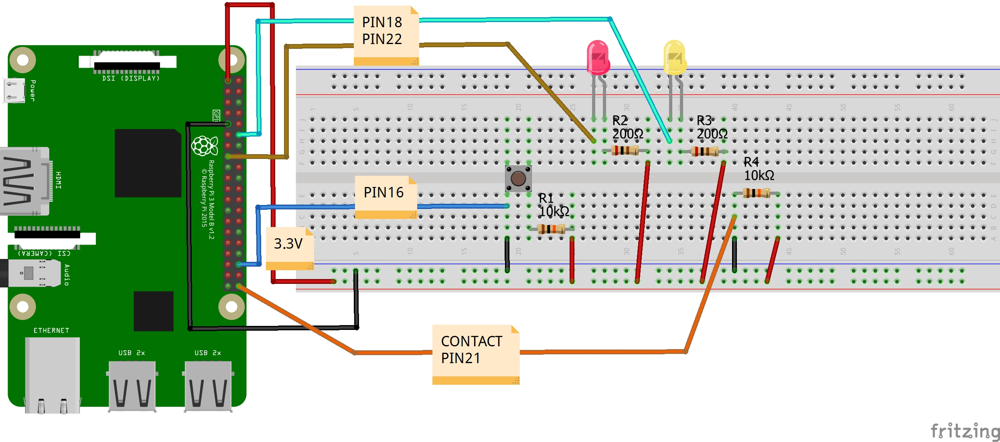
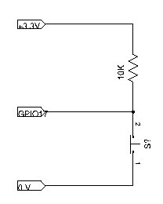
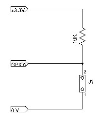
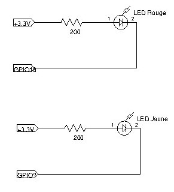
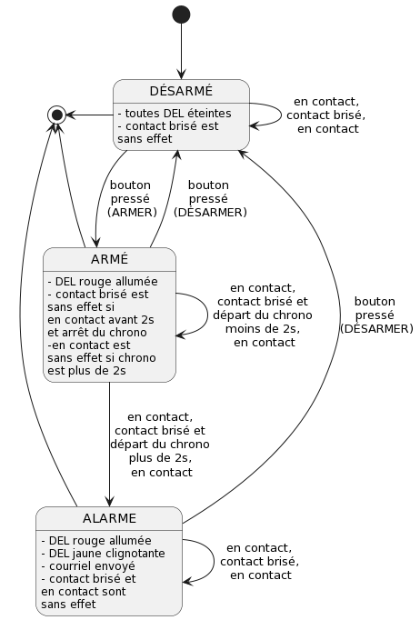

# Système d'alarme avec un Raspberry Pi

## v1; système d’alarme avec bouton

**Objectif:** maitriser les fondements des nanoordinateurs (Raspberry Pi), des OS Linux (Raspbian, mais aussi Ubuntu, les CLI) et de montages, du langage Python embarqué, de concepts comme les rappels haut et bas, les fils d’exécution (*thread*), les évènements sur le système (bouton), la gestion du temps avec time et datetime, les extractions web avec requests, le protocole smtp avec smtplib, et plus afin de construire des projets simples en IoT et de pouvoir collaborer avec des spécialistes de ces domaines dans des projets avancés.

| Échantillons  |   |   |
|:---|:---|:---|
| Diagramme Fritzing; global et bouton  |   |   |
| Diagramme Fritzing; contact et DEL |   |   |
| Diagramme d'états  |   |   |

