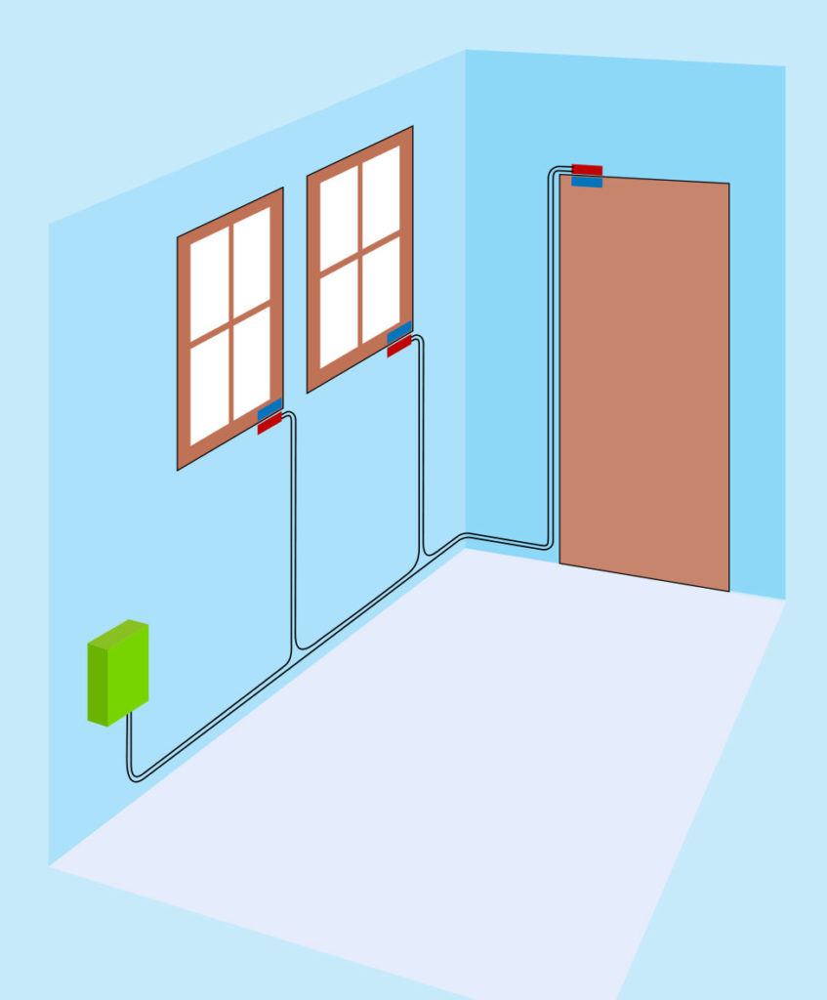
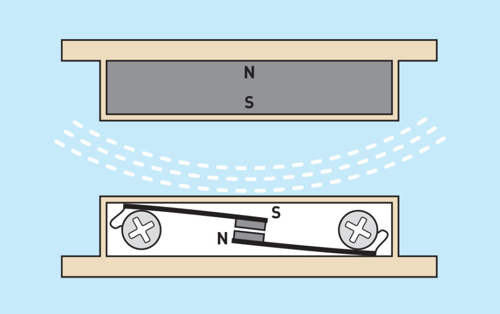
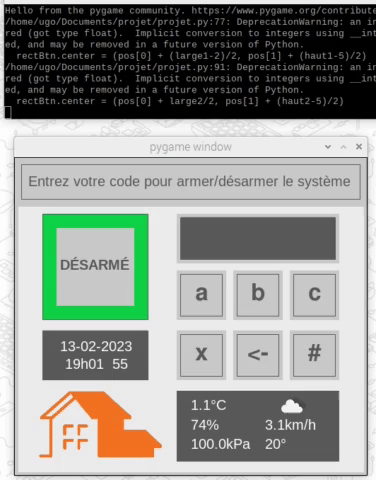
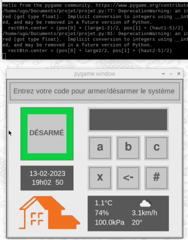
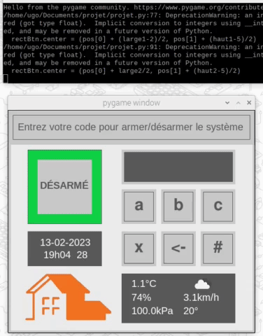
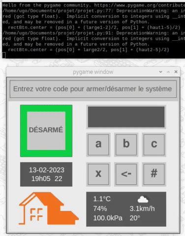

# Système d'alarme avec un Raspberry Pi

Des projets proches du projet **Domotique avec commandes vocales et Tkinter sur des Raspberry Pi**: <a href="https://github.com/ugolabo/domotique_commandes_vocales">bouton droit vers repo</a>

- [Projet, v1](#projet-v1-syst%C3%A8me-dalarme-avec-bouton)
- [Projet, v2](#projet-v2-syst%C3%A8me-dalarme-avec-console-pygame)

## Projet, v1: système d'alarme avec bouton

**Objectif:** maitriser les fondements des nanoordinateurs (Raspberry Pi), des OS Linux (Raspbian, mais aussi Ubuntu, les CLI) et de montages, du langage Python embarqué, de concepts comme les rappels haut et bas, les fils d'exécution (*thread*), les évènements sur le système (boutons), la gestion du temps, le protocole SMTP pour les courriels, et plus afin de construire des projets simples en IoT et de pouvoir collaborer avec des spécialistes de ces domaines dans des projets avancés.

Montage:

- un contact représentant une porte ou une fenêtre
  - lorsque le fil est branché, le circuit est fermé et l'état du contact est actif
  - lorsque le fil est débranché, le circuit est ouvert et l'état du contact est inactif
- un bouton
  - pour armer ou désarmer le système: état armé ou désarmé
- une DEL rouge allumée; système en état armé
- une DEL jaune clignotante; système en état d'alerte

Schéma Fritzing global avec un Raspberry Pi 3 (le projet a été fait avec un RPi4)

| Schéma bouton | Schéma contact  | Schéma DEL  |
|:---|:---|:---|
|  |   |   |

Concrètement, le contact pourrait être un interrupteur reed (ou alors un détecteur de mouvement ou de proximité)

|   |   |    |
|:---|:---|:---|
|  |   |   |

Diagramme d'états

## Projet, v2: système d'alarme avec console Pygame

**Objectif:** poursuivre avec la programmation embarquée et s'initier à la programmation orientée objet en Python pour gérer les états et les changements d’état, la journalisation (*logging*), la conception d'interfaces graphiques (avecPygame), la gestion de plus d'évènements sur le système (clavier, souris), la récupération de données du web avec un *API* (OWM), l'importation de données de fichiers YAML, l'architecture de paquets et la configuration des fichiers et dossiers Python avec des fichiers comme `__init__.py` et `main.py` ou une ligne d'instruction comme  `__name__ == "__main__":` et plus.

| Clavier | Armer, désarmer  |
|:---|:---|
|   |  |
| **Tenter d'armer, armer**  | **Déclencher, désarmer ou alerte** |
|   |  |
